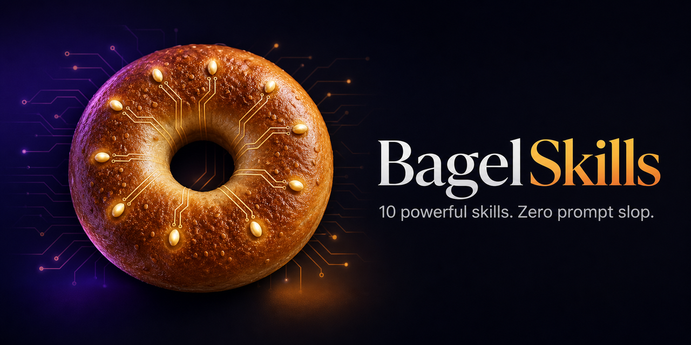

<div align="center">



# BagelSkills

**10 unusually powerful Agent Skills for sharper products, safer changes, better interfaces, and more reliable AI-agent work.**

[](https://agentskills.io/specification)
[](https://github.com/BagelHole/BagelSkills/actions/workflows/validate.yml)
[](LICENSE)

</div>

BagelSkills is a focused collection of production-grade skills for Claude Code, Codex, Gemini CLI, GitHub Copilot, Cursor, Hermes, and other clients that support the open [Agent Skills](https://agentskills.io/) format.

These are not prompt snippets. Each skill defines a disciplined workflow, completion criteria, evidence rules, reusable output template, trigger evaluations, and output-quality evaluations.

## The 10 skills

| Skill | What it changes |
|---|---|
| [Grill Me Until It’s Clear](skills/grill-me-until-its-clear/) | Turn an exciting but underspecified idea into a brief that another person or agent can execute without inventing product decisions. |
| [Anti-Slop Frontend](skills/anti-slop-frontend/) | Create interfaces with a defensible visual point of view, complete interaction states, and evidence that the rendered product works. |
| [UX Friction Hunter](skills/ux-friction-hunter/) | Find the moments where real users hesitate, misunderstand, abandon, or fail—and make every finding reproducible. |
| [Failure Museum](skills/failure-museum/) | Use the codebase’s own history to show how it tends to fail and what would prevent the next recurrence. |
| [Scope Sniper](skills/scope-sniper/) | Cut scope until the next build proves something important rather than merely producing more software. |
| [Repository Archaeologist](skills/repo-archaeologist/) | Explain how the repository became this way, where its real boundaries lie, and what a newcomer must not accidentally break. |
| [Launch Forensics](skills/launch-forensics/) | Find the defects and missing controls most likely to damage a real launch, backed by direct verification. |
| [Blast Radius](skills/blast-radius/) | Know what a consequential change can break, how failures will propagate, and how to contain them before implementation begins. |
| [Decision Tribunal](skills/decision-tribunal/) | Put consequential choices on trial so the final recommendation survives strong opposition rather than winning a shallow pros-and-cons contest. |
| [Agent-Proof Work](skills/agent-proof-work/) | Write task contracts autonomous agents can finish correctly without guessing hidden decisions or declaring victory early. |

## Install

Install every skill with the open [`skills`](https://github.com/vercel-labs/skills) CLI:

```bash
npx skills add BagelHole/BagelSkills
```

Install one skill:

```bash
npx skills add BagelHole/BagelSkills --skill blast-radius
```

Discover available skills without installing:

```bash
npx skills add BagelHole/BagelSkills --list
```

You can also copy any directory under `skills/` into the skills directory used by your agent client.

## Try these

```text
Use blast-radius before we rename this public API field. Map old mobile clients,
partner consumers, tests, rollout gates, signals, and rollback limits.
```

```text
Grill this product idea until another engineer could build it without inventing
a consequential requirement. Do not start implementation.
```

```text
Our dashboard works but looks like twenty identical cards. Apply anti-slop
frontend, preserve the data, and verify desktop and mobile screenshots.
```

## Why this collection is different

- **Focused:** ten distinct skills rather than an uncurated prompt warehouse.
- **Outcome-driven:** every workflow ends with checkable completion criteria.
- **Evidence-aware:** observations, inferences, assumptions, and unknowns stay separate.
- **Progressively disclosed:** concise `SKILL.md` files point to deeper references only when needed.
- **Evaluated:** every skill ships trigger and output-quality cases.
- **Portable:** only the open Agent Skills contract is required; client-specific behavior is not baked in.

## Repository structure

```text
skills/<skill-name>/
├── SKILL.md
├── assets/output-template.md
├── references/playbook.md
└── evals/
    ├── evals.json
    └── trigger-evals.json
```

## Validate locally

The repository validator checks the Agent Skills specification, links, eval schemas, and collection invariants using only Python's standard library:

```bash
python scripts/validate.py
```

For strict reference validation with the official `skills-ref` library:

```bash
uvx --from git+https://github.com/agentskills/agentskills.git#subdirectory=skills-ref skills-ref validate skills/blast-radius
```

## Contributing

New skills must earn their context: they need a distinct trigger, a real procedural advantage over general model behavior, positive and negative trigger evals, output evals, and checkable completion criteria. See [CONTRIBUTING.md](CONTRIBUTING.md).

## License

MIT. See [LICENSE](LICENSE).
